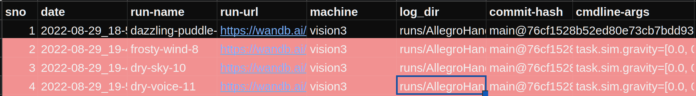

# ml_runlog - logging for machine learning experiments

This package is a wrapper around `pygsheets` and uses the google sheets API to automatically log launched runs to a google sheet. 

## Installation

- Follow instructions from https://pyshark.com/google-sheets-api-using-python/ to make a google cloud console account (non CMU id)
- Use these instructions to make a service account and get a `credentials.json`: https://docs.gspread.org/en/latest/oauth2.html#for-bots-using-service-account
- Make the spreadsheet and share it to the client email in the service account credentials
- Run `pip install ml_runlog` to install the package

## Logging data

To log data, add some code to the beginning of your training script. First, connect to the sheet you want to log to. 

```
ml_runlog.init(
    creds_path, # path to credentials.json file
    sheet_name  # name of the sheet you want to log to
)
```

Data can be logged in the following way 

```
ml_runlog.log_data(
      datetime=time_str,
      run_name=run_name,
      run_url=run_url,
      machine=os.uname().nodename,
      log_dir=experiment_dir,
      commit_hash=get_current_commit_hash(),
      cmdline_args=";".join(sys.argv[1:])
  )
```

In general, arbitrary keyword arguments can be passed to the above function

```
ml_runlog.log_data(
      column1=value1,
      column2=value2,
      ...
  )

```

Each run of the script will append a new row to the sheet which can then be moved around as needed. 



## Retrieving runs

Runs can be retrieved by serial number as follows. The retrieved data can be used by a script that fetches configs from wandb or runs eval. 

```
ml_runlog.init(creds_path, sheet_name)
df = ml_runlog.worksheet.get_as_df()
idx = df['sno'].tolist().index(args.sno)
row = df.iloc[idx].tolist()
```
